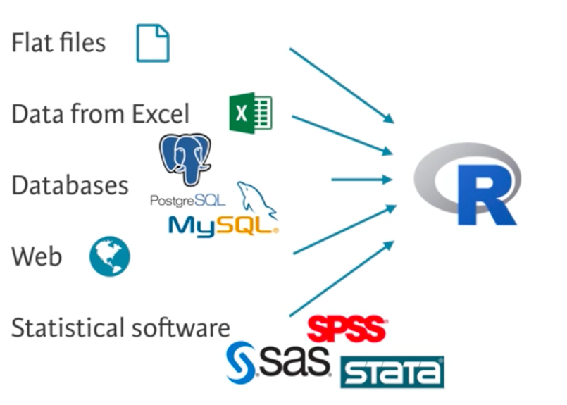

# Introduction to Programming in R

This course provides an introduction to R as a programming language, including: 

- basic calculations
- data structures (vectors, matrices and data frames)
- control structures (if, while and for)
- functions
- importing data
- plotting charts

We will not look at data handling or statistical tests in detail, as these are beyond the scope of this introductory course.


## What is R?

R is 

- a powerful language and environment for statistical computing and graphics.
- based on the S language developed at Bell Labs.
- Free Software under the GNU General Public License.
- not a spreadsheet!

R is supported on MS Windows, MAC OS-X and LINUX.

Main website: [cran.r-project.org](http://cran.r-project.org).

R is often used in combination with the [RStudio](https://rstudio.com/) interface for educational and research purposes.


## Getting started in RStudio


- Bottom left: Console window (type commands here and see the output directly)
- Top left: Editor window (for editing R notebooks and scripts)
- Top right: Workspace / history window (examine the current workspace, import datasets, see commands entered previously)
- Bottom right: Files / plots / packages / help window (change working directory, install packages, see graphics output, browse help)


## R notebooks

This document is an example of an *R notebook*, which combines text and code and makes it easy to embed R analysis within a report (HTML, PDF, Word document or presentation slides). This can help to make research more reproducible by allowing you to share an entire analysis workflow together with its narrative.

When you open the notebook's source code (*.Rmd* file) in RStudio, you can view and edit it in the editor window.

Text is formatted using the [R markdown](https://rmarkdown.rstudio.com/) notation, which is derived from [Markdown](https://github.com/adam-p/markdown-here/wiki/Markdown-Cheatsheet). This is a simple way to apply styling to text and indicate the structure of your document.

R code is included as *chunks*, which look like this:

```{r}

## R code lives here
print("Hello RStudio!")

```

Note that anything following the `#` symbol is a comment and is ignored by R.

When the cursor is inside a chunk, you can execute the code using *Ctrl-Shift-Enter*. The commands and output appear in the console window as if the chunk had been copy-pasted there. The output also appears in the notebook just after the chunk.

The `[1]` preceding the output just shows that this is the first item in a vector of output.

When you are ready to compile the notebook to HTML/PDF/Word, use the _Preview_ or _Knit_ buttons at the top of the editor window.

A notebook is a living document. You are encouraged to make use of this notebook to try out the example code, change it and add your own notes and code chunks. You can insert a new code chunk using the shortcut _Ctrl+Alt+I_.


## Help

R has various interactive help facilities. The most useful, to access
the manual pages for a specific command, is simply to use
`?function`. For example

```{r}
?mean
```

The R manual pages include a "See Also" and "Examples" section, which can be very useful. 

The function `help.start` will fire up the HTML help system, which allows keyword searching.


---

# R as a Calculating Environment

The simplest R commands are just mathematical expressions, which are evaluated and the answer is printed out to the console.

```{r}
2 + 2
```

You can write numbers as decimals or using scientific notation, e.g. `0.001` is equivalent to `1e-3`.


## Arithmetic operators

- Addition: `+`
- Subtraction: `-`
- Multiplication: `*`
- Division: `/`
- Exponentiation: `ˆ` (i.e. 'to the power of')
- Integer Division: `%/%` (i.e. division without allowing fractions)
- Modulo: `%%` (i.e. the remainder after integer division)

Note that multiplication/division take place before addition/subtraction. You can change the order of operations using parentheses `()`. e.g.

```{r}
5 + 6 / 2
```

vs.

```{r}
(5 + 6) / 2
```


#### Exercise {-}

You have 3 pound coins, 3x 50p, 3x 20p and 4x 5p. Flapjacks cost 89p. How many can you buy?
```{r}
# write the expression below and use Ctrl-Shift-Enter to evaluate it

```

How much money will you have left?
```{r}

```


## Mathematical functions and constants

There are a number of basic mathematical functions available, e.g.

- `sqrt()`: square root
- `sin()`, `sinh()` and the other trigonometric / hyperbolic functions
- `asin()`, `asinh()` and the other inverse functions 
- `exp()`: natural exponential function
- `log()`, `log10()`: logarithmic functions
- `abs()`: absolute value
- `round()`: round to the closest integer
- `floor()`: round down
- `ceiling()`: round up

Also `pi` for mathematical $\pi$

e.g.
```{r}
cos(pi/3)
```


#### Exercise {-}

What happens when the input provided is outside the domain of a function (e.g. log(-4))?

```{r}

```


## Basic data types in R

R works with numerous data types. Here are some of the most basic ones:

- Decimal values like `4.5` are called **numeric**.
- Natural numbers like `4` are called **integers**. Integers are also numeric.
- Boolean values (`TRUE` or `FALSE`) are called **logical**.
- Text (or string) values (`"a"`,`"apple"`,`"54"` etc.) are called **character**.
- Complex numbers (e.g. `5+3i`) are called **complex**.

To check the data type of a variable, the function `class()` is used.


## Variables

A **variable** is a basic concept in all programming. You can think of a
variable as a labelled container that allows you to store a value (e.g. 55) or an object (e.g. a data structure).

The assignment operator `<-` is preferred for variable assignment in R, but `=` will also work.

```{r}
a <- 5
b = 9
```

You can then use this variable’s name to easily access the value or the object that is stored within this variable. 
Use `print()` or `show()` to display values in the console window. Putting parentheses around an expression is another alternative.

```{r}
print(a)
show(b)
(a+b)
```

You can easily change the value assigned to a variable.
```{r}
a <- 101
print(a)

a <- a + 10
print(a)
```

The variable is retained in memory (see the environment window at top right) until deletion with `rm()`.

```{r}
rm(a)
print(a)
```

Note that rm is *not* reversible.

Variables should have names that are *meaningful*, and should follow the R syntax
rules, that the name should consist of only

- letters (a-z / A-Z) 
- numbers
- period `.`
- underscore `_`

A name must start with a letter or period. Names starting with a period are hidden by default.

A common problem is trying to use names that are already in use by R:
e.g. reserved words like `if` or `break` or system objects like `mean`, `TRUE`,
and `pi`.

Another common irritation for new users is that R is *case sensitive*,
so `T` (a system representation of logical true) is different to `t`
(function for matrix transpose).


## Logical expressions

The comparison operators known to R are:

- `<` for less than
- `>` for greater than
- `<=` for less than or equal to
- `>=` for greater than or equal to
- `==` for equal to each other
- `!=` not equal to each other

e.g.
```{r}
a <- 21
a > 12
```

The output of a logical expression is one of the *boolean* values `TRUE` or `FALSE`.

We will also need to handle more complex comparisons, like ”greater than 12, and even.” Such comparisons require the *logical operators*:

- `!` logical NOT
- `&` logical AND
- `∣` logical OR

```{r}
a>12 & a %% 2 == 0
```


## Precision and rounding error

R calculates all values to a high precision, but will only display the first 7 significant figures by default.
You can change this using a command like `options(digits = 10)` (which shows the first 10 digits).

However, only fractions whose denominator is a power of 2 can be represented exactly by R. 
All other real values are subject to rounding error, which can cause a lot of confusion when testing for equality, e.g.

```{r}
sqrt(2) * sqrt(2) == 2
```

To get around this issue, we use the function `all.equal()`, which returns `TRUE` if the difference between its two arguments is less than R's level of accuracy:

```{r}
all.equal(sqrt(2)*sqrt(2),2)
```


## Vectors

Vectors are the fundamental data structure in R. A vector is an
*integer-indexed* one-dimensional array that can hold of data of the
*same* type.

```{r}
my.integers <- 1:10 # sequence of integers from 1 to 10
my.integers
length(my.integers) # length of a vector
```


To create a vector in R, the combine function `c()` is used. For
example:
```{r}
numeric.vector <- c(1, 10, 49)
character.vector <- c( "a", "b", "c")
logical.vector <- c(TRUE, FALSE, TRUE)
```


Other useful functions for creating numeric vectors include `seq()` and `rep()`.
```{r}
seq(from=1, to=7, by=3)
rep(1:4, times=2)
```


You can give a name to the elements of a vector with the names() function.
```{r}
names(numeric.vector) <- character.vector
show(numeric.vector)
```


### Operations on vectors

Different types of operations are appropriate for vectors of different type. 
Perhaps the most familiar is arithmetic for numeric vectors.
It is important to understand that if you perform arithmetic operations
on two vectors in R, it performs *element-wise* operation:

```{r}
x <- c(6.5, 4.7, 1.2, -3.3)
y <- c(1, 2, 3, 4)

x+y
x/y

```

#### Exercise {-}

What happens when we try to do arithmetic with vectors that are of different lengths? Or when we mix a scalar with a vector?
```{r}
x <- c(6.5, 4.7, 1.2, -3.3)
y <- c(1, 2)


```

Try applying some mathematical functions to a numeric vector. Use `plot(x,y)` to see the results
```{r}
x <- -10:10


```


Find the `sum`, `mean` and `median` of the data provided.
```{r}
my.data <- c(6.1, 2.7, 1.2, 3.4, 2.0, 8.0, 3.3, 1.2, 6.1)


```

Some other useful functions for vectors: `unique()`,`sort()`,`prod()`,`max()`,`min()`,`sqrt()`,`var()`,`sample()`. Try these out below.
```{r}


```


### Selection by index

We often need to select elements of numeric vectors (or other data
structures). Such selection can be implemented a number of ways.
The simplest method is numerical indexing using square brackets `[]`.

```{r}
x <- 20:10
x[1]

index <- c(1, 3, 5) # a vector of the indices we want
x[index]
```

Note that indices in R start from `1`, not `0` as in many other languages.

If names have been assigned to the vector elements, we can select by name instead of by numeric position:

```{r}
numeric.vector["c"]
```


### Selection by comparison

It is often useful to do conditional selection. For example, to select only the
positive values from a vector. This requires the _logical_ and _comparison_ operators.

```{r}
x <- 20:12
x > 15

index <- x > 15
x[index]
```

The vector `index` is logical, containing element-wise Boolean values (`TRUE` or `FALSE`) for the comparison. 
The `[]` operator handles a logical vector by selecting only those values that are true.

We use `which(x)` to find the index positions of the `TRUE` elements of a logical vector `x`.

```{r}
which(index)
```


#### Exercise {-}

Look at the following expressions. Can you describe what they do?
```{r}
index
sum(index)
sum(x[index])

```

Note that here the vector `index` is logical, containing the values `FALSE` and `TRUE`. 
The `sum()` function has *coerced* these logical values to  numeric ones (reading `FALSE` as `0` and `TRUE` as `1`).
This automatic coercion makes R very flexible, but can also be a source of confusion.

To explicitly coerce objects from one class to another, we can use the `as.*` functions, e.g.
```{r}
as.numeric(index)

```


### Combining logical vectors

Logical vectors can be combined element-wise with `!` (logical NOT), `&` (logical AND ) and `∣` (logical OR).

```{r}
x <- 20:10
index.odd <- (x %% 2)
index.odd

index.gt15 <- x > 15
x[index.odd & index.gt15]
```

The vector `index.odd` is actually numeric, containing values `0` and `1`. 
The `&` operator has coerced these numeric values to logical ones (reading `0` as `FALSE` and any other number as `TRUE`).


#### Exercise {-}

Which indices of `x` have values between 11 and 18 and are divisible by 3? Use a logical expression.
```{r}
x <- 20:10


```


### Vector transformations

Having selected a subset of indices, we can make conditional assignments, e.g.

```{r}
x <- 20:10
x[x < 15] <- -1 # assign elements less than 15 to be -1

x

```


#### Exercise {-}

You have started a business selling flapjacks outside the underground station.
The vectors below show your income and expenses for the first five days of trading.

Create the following variables:

1. `profit`, your daily profit (a vector).
2. `profit.total`, your overall profit at the end of the week (a scalar).
3. `profitable.days`, the names of the days on which you made a positive profit (a vector).

```{r}
days <- c("Monday", "Tuesday", "Wednesday","Thursday", "Friday")
income <- c(140, 101, 25, 42, 120)
expenses <- c(220, 23, 0, 51, 34)


```

For tax reasons, you decide to donate any daily profit over £50 to charity.
Calculate your daily donations (a vector).

```{r}

```


## Matrices

In R, a matrix is a two-dimensional collection of elements of the
same data type (numeric, character, or logical) arranged into a
fixed number of rows and columns.

A matrix is constructed from a vector by filling positions by column or by row:

```{r}
A <- matrix(1:6, nrow=3) # default filling is by column
A
dim(A) # matrix dimensions (rows first)
```

```{r}
B <- matrix(1:6, byrow=TRUE, nrow=3) # switch to filling by row
B
dim(B) # matrix dimensions (rows first)

```


The functions `colnames()` and `rownames()` are used to add names for the the columns and the rows of a matrix.
The functions `rowSums()` and `colSums()` conveniently calculate the totals for each row and column of a matrix.

A diagonal matrix can be constructed using the function `diag()`, e.g.

```{r}
diag(4)
diag(4, x=1:4)
```


Selection (and modification) of elements of a matrix uses the `[]` operator, but with two indices:

```{r}
A[2,2] # single element
A[,2] # single column
A[2,] # single row

A[2] # single element, treating the matrix as a vector
```


The functions `cbind()` and `rbind()` are available for concatenating matrices (or vectors) by row (row bind) or column (column bind).
The dimensions must conform.


#### Exercise {-}

Use `cbind()` and `rbind()` to combine `A` and `B`. What are the dimensions of the resulting matrices?
```{r}


```


### Matrix Transformations (1)

As with vectors, element-wise arithmetic can be applied to matrices.


```{r}
1 + A / 2
```

Note that `*` operates element-wise. For matrix multiplication, use `%*%`

```{r}

C <- matrix(1:4,nrow=2)

C
C * C
C %*% C

```


Many functions can also be applied element-wise to matrices, e.g.

```{r}

log(A)

```

Some other functions taking matrix arguments:

- `nrow(A)`
- `ncol(A)`
- `det(A)` (the determinant of `A`)
- `t(A)` (the transpose of `A`)
- `solve(A,B)` returns `x` such that `A %*% x == B`

If `A` is invertible, `solve(A)` returns the matrix inverse of `A`.

```{r}
invC <- solve(C)
C %*% invC

```


---

# R Programming Basics

## Control Structures

To release the power of the programming language, we need the language constructs which provide *control structures*, giving the
capacity for *selection* and *iteration*.

### If statement

It is often the case that we want a program to take different
actions according to the value of a variable. The R language
statement `if` provides this functionality. The general syntax is

```{r}
if (condition) {
  #true branch
} else {
  #false branch
}
```

We have already seen a variety of logical comparisons that can
serve as `condition`. If `condition` evaluates as `TRUE`, then
the *true branch* is evaluated, otherwise the *false branch* is evaluated.
The `else` part of an if statement is optional.

If `condition` evaluates to `NA` (i.e. missing data), an error occurs.

`if` can also occur within a branch of another `if`
statements. That is, `if` can be nested. For example

```{r}
if (condition.1) {
  if (condition.2) {
    #...
  } else {
    #...
  }
  else if (condition.3) {
  #...
} 
```


#### Exercise {-}

Given the coefficients $a$, $b$ and $c$ of a quadratic equation $ax^2 + bx + c = 0$, store the real roots in the vector `roots` and display them.

```{r}
a <- 1
b <- 5
c <- 3


```


### While loop

Loops can come in handy on numerous occasions. `while` loops are
like repeated `if` statements.

```{r}
while (condition) {
  # expression
}
```

Remember that the `condition` part of this recipe should become
`FALSE` at some point during the execution. Otherwise, the while
loop will go on indefinitely. 


#### Exercise {-}


Complete the code to find the first Fibonacci number greater than 100.
```{r}
F <- c(1,1)
n <- length(F)

while(){
 
  
  
}

show(F[n])

```


### For loop

The `for` loop is designed to iterate over all elements in a vector.
Consider the following loops, which do the same thing:

```{r}
primes <- c(2, 3, 5, 7, 11, 13)

# loop version 1
for (p in primes) {
  print(p)
}

# loop version 2
for (i in 1:length(primes)) {
  print(primes[i])
}
```

The first version is concise and easy to read, but has no access to
the looping index, whereas the second version is very versatile but
a bit harder to read and write.

#### Exercise {-}

Complete the `for` loop to calculate the factorial of a given number, `n`
```{r}
n <- 6
n_factorial <- 1

for(){
  
  
}

show(n_factorial)

```


## Functions

The Black-box Principle:


We have seen that functions have arguments. To examine the
arguments for a function use args. For instance:
```
> args(mean)
> args(sd)
```
Argument lists include named values with specified defaults, in the
format `name=value`. R can match arguments both by position and
by name.

R can match arguments both by position and by name.

- Position: Provide arguments in the order given by the function
prototype.
- Provide arguments explicitly by name, as name=value. Only
sufficient letters of the name to uniquely identify it are
required, but note case-sensitivity.

These two approaches can be mixed. For example;
```
> linkedin <- c(16, 9, 13, 5, NA, 17, 14))
> mean(linkedin, na.rm = TRUE)
```

For the function mean, `x` is required; if you do not specify it, R will
throw an error. `trim` and `na.rm` are optional arguments: they
have a default value which is used if the arguments are not
explicitly specified.

### Writing your own Functions

R allows (encourages!) the user to define their own functions. The
main function definition syntax is:

```
functionname <- function (args) {
  assignments and expression
  result , can also use return()
}
```

where `args` is a set of arguments. Note that curly braces are used
to demark blocks of code. The function is called
`functionname(args)`.

You can define default argument values in your own R functions as
well. You can use the following recipe to do so:
```
my fun <- function(arg1, arg2 = val2) {
  body
}
```

#### Exercise {-}

1. Create a function `pow_two()`: it takes one argument and
returns that number squared (that number times itself).
2. Call this newly defined function with 12 as input.
3. Add an optional argument, name `print_info`, that is `TRUE`
by default.
4. Wrap an `if` construct around the `print()` function: this
function should only be executed if `print_info` is `TRUE`.

```{r}

```

---

## The apply family

Bad use of loops is the most common source of inefficient R code.
Whenever you’re using a for loop, you might want to revise your
code and see whether you can use the apply family functions
instead.

### apply on a matrix

We frequently need to apply transformations to each row or
column of a matrix separately. The R approach to this is not to explicitly loop
over the appropriate structure, as would be natural in many
languages. Instead, use the function `apply()`, which handles the
looping implicitly. 


For example:

```
> apply(my.mat, MARGIN = 1, FUN = mean) # note the CASE of argument names
[1] 2 3
```

Here, we have computed the mean (`FUN = mean`) for each
row (`MARGIN = 1`). Note also another style of function call.

`apply()`, can handle extra arguments to the “applied function“.
Care is needed to handle the structure that is returned.


There are three variants: `lapply()`, `sapply()` and `vapply()`.
The apply family provides us with a easier and more intuitive way
of applying a function over a list or a vector. 


### lapply

The syntax for using `lapply()` is as follows:

```
> lapply(X, FUN, ...)
```

To put it generally, `lapply` takes a vector or list `X`, and applies the
function `FUN` to each of its members. If `FUN` requires additional
arguments, you pass them after you’ve specified `X` and `FUN` (...).
The output of `lapply()` is a list, the same length as `X`, where
each element is the result of applying `FUN` on the corresponding
element of `X`.

**Example**

Suppose we have a list for New York City named `nyc` and we
want to know the class of each element in the list:
```
nyc <- list(pop = 8405837, boroughs = c("Manhattan","Bronx", "Brooklyn", "Queens", "Staten Island"), capital = FALSE)

# Using for loop
> for (info in nyc) {
  print(class(info))
}

[1] "numeric"
[1] "character"
[1] "logical"

# Using lapply
> lapply(nyc, class)
$pop
[1] "numeric"
$boroughs
[1] "character"
$capital
[1] "logical"
```

If we want the output of the `lapply` function to be a vector, we
simply wrap the `lapply` function inside the `unlist` function as
follows:

```
> unlist(lapply(nyc, class))
> [1] "numeric" "character" "logical"
```

#### Exercise {-}

1. Create a vector named pioneers defined as follows:
```
> pioneers <- c("GAUSS:1777", "BAYES:1702",
"PASCAL:1623", "PEARSON:1857")
```
2. Use the function `strsplit()` that splits the strings in
pioneers on the `:` sign. The result, `split_math` is a list of 4
character vectors: the first vector element represents the
name, the second element the birth year.
3. Use `lapply()` to convert the character vectors in
`split_math` to lowercase letters: apply `tolower()` on each of
the elements in `split_math`. Assign the result, which is a list,
to a new variable `split_low`.
4. Inspect the contents of `split_low` with `str()`.


```{r}

```


### sapply 


### vapply


# Data Handling in R


## Data Frames

Data frames are the most useful object for routine statistical
analysis. A data frame has the variables of a dataset as columns
and the observations as rows.

Here, different variables may have different types (character vector,
factor, numeric), and the data frame will preserve this.

For example, when doing a market research survey, we often have
questions such as:

- 'Are you married?' or 'yes/no' questions (logical)
- 'How old are you?' (numeric)
- 'What is your opinion on this product?' or other ’open-ended’ questions (character)

To construct a data frame in R, we use the `data.frame()`
function. As arguments, we pass pre-defined vectors that become
the different columns of the data frame. The argument vectors
should also have the same length.

```{r}
# Definition of vectors
name <- c("Earth", "Mars", "Jupiter", "Saturn")
type <- c("Terrestrial planet", "Terrestrial planet", "Gas giant", "Gas giant")
diameter <- c(1, 0.532, 11.209, 9.449)
day <- c(1, 1.03, 0.41, 0.43)
rings <- c(FALSE, FALSE, TRUE, TRUE)

# Create a data frame from the vectors
planets <- data.frame(name, type, diameter, day, rings)
```

When working with (extremely) large data sets and data frames,
the first task as a data analyst is to develop a clear understanding
of its structure and main elements. Therefore, it is often useful to
show only a small part of the entire data set.

`head()` and `tail()` print out the first and last observations of a
data frame.

```{r}
head(planets)
```


To get a rapid overview of the data, the function `str()` is used,
which shows the structure of the dataset in hand. For a data frame
it tells:

- The total number of observations
- The total number of variables
- A full list of the variables names
- The data type of each variable
- The first observations

```{r}
str(planets)
```


Selection proceeds as before. Try the following:

```{r}
planets[1,2] # a single element indexed by row and column
planets[1:3,] # a subset of rows
planets$type # a single column, equivalent to planets[[2]]
planets[1:3,"day"] # a single column for a subset of rows
planets[rings,] # selects the planets with rings

planets$radius <- planets$diameter / 2 # constructs a new column
head(planets)
```

Another way to select create a subset of a data frame based on
some condition is to use the `subset()` function.

```
> subset(planets, subset = rings)
```

To sort the data according to a certain variable in the data set, the
function `order()` is used.

```
> planets <- planets[order(planets$diameter)]
```

## Lists

A list in R allows you to gather a variety of objects under one
name (that is, the name of the list) in an ordered way. These
objects can be matrices, vectors, data frames, even other lists, etc.
It is not even required that these objects are related to each other
in any way or are of the same length.

```
> # Vector with numerics from 1 up to 10
> my vec <- 1:10
> # Matrix with numerics from 1 up to 9
> my mat <- matrix(1:9, ncol = 3)
> # First 10 elements of the built-in data frame mtcars
> my df <- mtcars[1:10,]
> # Construct list with these different elements:
> my list <- list(vec = my vec, mat = my mat, df = my df)
```

The names() function can also be used to name the elements of a
list.
Different ways of referring to elements of a list. Using the `$`
operator for explicit naming, or `[[]]`
```
> my list$vec
> my list[["vec"]]
> my list[[1]] # these are equivalent
```
To apply a function to each element of a list, use `sapply()` or `lapply()`.


## Data Utilities

R features a bunch of functions to juggle around with data structures:

- `seq()`: Generate sequences, by specifying the from, to, and by arguments.
- `rep()`: Replicate elements of vectors and lists.
- `sort()`: Sort a vector in ascending order. Works on numerics, but also on character strings and logicals.
- `rev()`: Reverse the elements in a data structures for which reversal is defined.
- `str()`: Display the structure of any R object.
- `append()`: Merge vectors or lists.
- `is.*()`: Check for the class of an R object.
- `as.*()`: Convert an R object from one class to another.
- `unlist()`: Flatten (possibly embedded) lists to produce a vector.


## Importing and Cleaning Data

R allows for importing files of the following types:



Flat files (or .csv files) are simple text files that display data as
tables. The most straightforward way to read tabular data into a
data frame is to import from a csv (comma separated value) file.
The advantage of this is that csv is a standard format.


The `utils` package, which is automatically loaded in the R session
on startup, can import CSV files with the `read.csv()` function.

```
> my.df <- read.csv("myfile.csv", stringsAsFactors = FALSE)) # file in working directory
```

With stringsAsFactors, you can tell R whether it should convert
strings in the flat file to factors.

For files stored in some other directory say ”datasets”:

```
path <- file.path("~", "datasets", "myfile.csv")
> my.df <- read.csv(path, stringsAsFactors = FALSE))
```

Aside from .csv files, there are also the .txt files which are basically
text files. We can import these functions with `read.delim()`. By
default, it sets the`sep` argument to `"\t"` (fields in a record are
delimited by tabs) and the header argument to `TRUE` (the first
row contains the field names).

`read.table()` is used for more exotic file formats. The header
argument defaults to `FALSE` and the `sep` argument is `" "` by
default.

Similarly, the most convenient format to output data frames to is
csv.

```
> write.csv(my.df,"my.csv") # working directory
```

Again, more control is achieved with `write.table()`.

The `data.table` package provides added functionalities for
handling big data sets. Its `fread()` function to import data is
extremely fast and convenient. The key features of this function
are:

- Infer column types and separators
- Extremely fast
- Possible to specify numerous parameters
- Improved `read.table()`
- Fast, convenient, customisable

R also has the `"readxl"` package to import excel sheets directly
and the `"XLconnect"` package to manipulate excel workbooks
directly using R.


### Understanding the structure of your data

- `class()` - Class of data object
- `dim()` - Dimensions of data
- `names()` - Column names
- `str()` - Preview of data with helpful details
- `glimpse()` - Better version of str() from dplyr
- `summary()` - Summary of data

### Looking at your data

- `head()` - View top of dataset
- `tail()` - View bottom of dataset
- `print()` - View entire dataset (not recommended!)

### Visualising your data

- `hist()` - View histogram of a single variable
- `plot()` - View plot of two variables

### Tidying your data

Principles of tidy data:

- Observations as rows.
- Variables as columns.
- One type of observational unit per table.
- `tidyr` package is quite handy for tidying data in R. Following are

some useful `tidyr` functions:

- `gather()` - Gather columns into key-value pairs.
- `spread()` - Spread key-value pairs into columns.
- `separate()` - Separate one column into multiple.
- `unite()` - Unite multiple columns into one.

### Preparing data for analysis

Dealing with type conversion, string manipulation, missing and
special values, and outliers and obvious errors.


#### Exercise {-}

Load the weather data in your workspace. Try the following to get a feel for the data:

1. Check that it’s a `data.frame` using the function `class()`.
2. Look at the dimensions.
3. View the column names.
4. View the structure of weather.
5. View a `summary()` of weather.

```

```

## Factors

The term factor refers to a statistical data type used to store
categorical variables. The difference between a categorical variable
and a continuous variable is that a categorical variable can belong
to a limited number of categories. A continuous variable, on the
other hand, can correspond to an infinite number of values.

It is important that R knows whether it is dealing with a
continuous or a categorical variable, as the statistical models you
will develop in the future treat both types differently.

A good example of a categorical variable is sex. In many
circumstances you can limit the sex categories to ”Male” or
”Female”.

`
>sex<-factor(c("Male","Female","Female","Male","Male"))
> sex
[1] Male Female Female Male Male
Levels: Female Male
`

Factors have an attribute called levels, which represent the unique
categories.

`
> levels(sex)
[1] "Female" "Male"
`

The simplest thing we can do with a factor is compute a frequency
table. You can also use the function `summary()`.

```
> table(sex)
sex
Female
2
Male
3
```

Comparisons and coercion can be deployed on factors

```
> sex == "Female"
[1] FALSE TRUE TRUE FALSE FALSE
> as.numeric(dept)
[1] 2 1 1 2 2
```

### Ordered Factors

There are two types of categorical variables: a nominal categorical
variable and an ordinal categorical variable.

A nominal variable is a categorical variable without an implied
order. This means that it is impossible to say that ‘one is worth
more than the other‘. For example, think of the categorical
variable animals vector with the categories “Elephant“, “Giraffe“,
“Donkey“ and “Horse“. Here, it is impossible to say that one
stands above or below the other.

In contrast, ordinal variables do have a natural ordering. Consider
for example the categorical variable temperature vector with the
categories: “Low“, “Medium“ and “High“. Here it is obvious that
“Medium“ stands above “Low“, and “High“ stands above
“Medium“.

To deal with the natural ordering between different categories of a
factor, we need to create an ordered factor.

```
> speed <- c("medium", "slow", "slow", "medium",
"fast")
> factor speed <- factor(speed, ordered = TRUE,
levels = c("slow", "medium", "fast"))
factor speed
[1] medium slow slow medium fast
Levels: slow < medium < fast
```

An ordered factor enables us to compare different elements.

```
factor speed[2] > factor speed[5]
[1] FALSE
```


---

# Data Visualisation

Graphical tools help us understand a dataset.
Our ability to interpret patterns is a key strength.

Two basic types of data visualisations:
1. Exploratory visualisations help us understand the data.
2. Explanatory visualisations help us share our understanding with
others.

R supports both types of visualisations.

## Four graphics systems in R

- Base graphics: Easiest to learn and focus of this course.
- Grid graphics: powerful set of modules for building other tools.
- Lattice graphics: general purpose system based on grid graphics.
- ggplot2: “the grammar of graphics”.

Base Graphics Example

```{r}
install.packages("MASS")
library(MASS)
plot(UScereal$sugars,UScereal$calories)
```

Scatterplot in base graphics
Variation of median house prices in Boston area with the average
number of rooms.
```{r}
plot(Boston$rm, Boston$medv, main = "Scatterplot", pch = 17)
```

Boxplot in base graphics
Variation of miles per Gallon with Number of Cylinders.
```{r}
boxplot(mpg~cyl,data=mtcars, main="Car Milage Data", xlab="Number of Cylinders", ylab="Miles Per Gallon")
```

Histogram in base graphics
Histograms are generated using a default binning strategy. To
specify the number of bins, modify the argument nbreaks. Specify
the breakpoints by providing a vector for the argument breaks..
```{r}
hist(mtcars$mpg, breaks=12, col="red")
```


Kernel Density Plots in base graphics
Kernel density plots are usually a much more effective way to view the distribution of a variable.
```{r}
d <- density(mtcars$mpg) # returns the density data
plot(d) # plots the results
```

Base R plots can be enhanced in many ways:

- Using different point shapes for different data subsets.
- Features like `points()`, `lines()` and `text()` can be added to the plot.
- Using different colours.
- Add `legend()`.

Useful links:
https://www.statmethods.net/graphs/scatterplot.html
https://www.statmethods.net/graphs/boxplot.html
https://www.statmethods.net/graphs/density.html

ScatterPlot with fit lines

```{r}
# Simple Scatterplot
attach(mtcars)
plot(wt, mpg, main="Scatterplot Example", xlab="Car Weight ", ylab="Miles Per Gallon ", pch=19)

# Add fit lines
abline(lm(mpg~wt), col="red") # regression line
lines(lowess(wt,mpg), col="blue") # lowess line
```


---

# Further Reading

Roger D. Peng, [R Programming for Data Science](https://bookdown.org/rdpeng/rprogdatascience/) (2019)


# Acknowledgements {-}

Many thanks to Anupriya, who developed the original version of this course.
