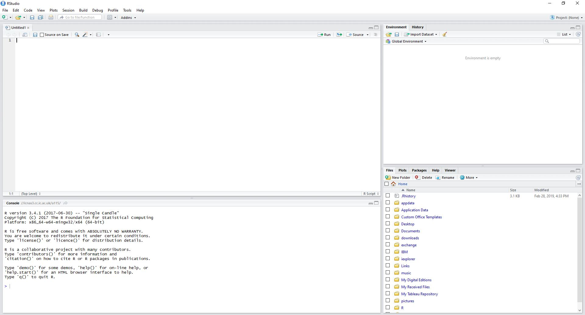

# Introduction

This course provides an introduction to R as a programming language, including:

- basic calculations
- data structures (vectors, matrices and data frames)
- control structures (if, while and for)
- functions
- importing and working with data
- plotting charts

We will not look at statistical testing or advanced data manipulation, as these are beyond the scope of this introductory course.


## What is R?

R is

- a powerful language and environment for statistical computing and graphics.
- based on the S language developed at Bell Labs.
- Free Software under the GNU General Public License.

R is supported on MS Windows, Mac OS-X and LINUX.

Main website: [cran.r-project.org](http://cran.r-project.org).

R is often used in combination with the [RStudio](https://rstudio.com/) interface for educational and research purposes.


## Getting started in RStudio



- Bottom left: console window (type commands here and see the output directly)
- Top left: editor window (for editing R notebooks and scripts)
- Top right: workspace / history window (examine the current workspace, import datasets, see commands entered previously)
- Bottom right: files / plots / packages / help window (change working directory, install packages, see graphics output, browse help)

## R notebooks

This document is an example of an *R notebook*, which combines text and code and makes it easy to embed R analysis within a report (ouput as HTML, PDF, Word document or presentation slides). This can help to make research more reproducible by allowing you to share an entire analysis workflow together with a narrative.

When you open the notebook's source code (*.Rmd* file) in RStudio, you can view and edit it in the editor window.

Text is formatted using the [R markdown](https://rmarkdown.rstudio.com/) notation, which is derived from [Markdown](https://github.com/adam-p/markdown-here/wiki/Markdown-Cheatsheet). This is a simple way to apply styling to text and indicate the structure of your document.

R code is included as *chunks*, which look like this:

```{r}
## R code lives here
print("Hello RStudio!")
```

Note that anything following the `#` symbol is a comment and is ignored by R.

When the cursor is inside a chunk, you can execute the code using *Ctrl-Shift-Enter*. The commands and output appear in the console window as if the chunk had been copy-pasted there. The output also appears in the notebook just after the chunk.

The `[1]` preceding the output just shows that this is the first item in a vector of output.

A notebook is a living document. You are encouraged to make use of this notebook to try out the example code, alter it, complete the exercises and add your own notes and code chunks. You can insert a new code chunk using the shortcut _Ctrl+Alt+I_.


## Working directory

Before you start work, please check your working directory:

```{r}
getwd()
```

We need the working directory to be the directory containing the data for this workshop. If necessary, you can change the working directory using the files window in RStudio (bottom right).
Navigate to the directory you want and click the cog icon for the "Set as Working Directory" option.

Alternatively, if you know the path to your working directory, you can use `setwd()`:

```{r}
setwd("path/to/my/working/directory")
```


## Help

R has various interactive help facilities. The most useful, to access
the manual pages for a specific command, is simply to use
`?function`. For example

```{r}
?mean
```

The R manual pages include a "See Also" and "Examples" section, which can be very useful.

The function `help.start` will fire up the HTML help system, which allows keyword searching.


