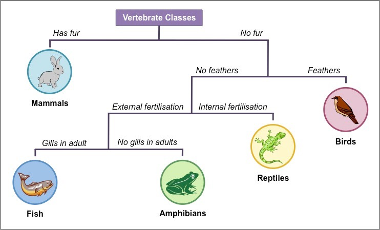
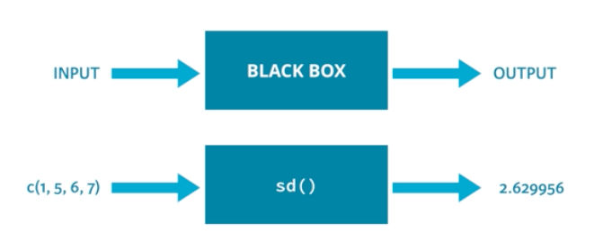

# R Programming Basics

Writing individual commands can take us a long way with R, but sometimes we need to do more than just execute a list of commands in sequence.
To release the power of the programming language, we need the language constructs which provide *control structures*, giving the
capacity for *conditional execution* and *iteration*. We will also see how to write reusable pieces of code as *functions*.

This is where we start to do real computer programming!

## `if` statement

It is often the case that we want a program to take different
actions according to the value of a variable. The R language
statement `if` provides this functionality. The general syntax is

```
if (condition) {
  #true branch
} else {
  #false branch
}
```

We have already seen a variety of logical comparisons that can
serve as `condition`. If `condition` evaluates to `TRUE`, then
the *true branch* is evaluated, otherwise the *false branch* is evaluated.

The `else` part of an if statement is optional. Note that in R it must appear on the same line as the preceding `}`.

If `condition` evaluates to `NA` (i.e. missing data), an error occurs.

`if` can also occur within a branch of another `if`
statements. That is, `if` can be nested. For example
```{r}
day <- "Tuesday"
weekdays <- c("Monday", "Tuesday", "Wednesday","Thursday", "Friday")
weekend <- c("Saturday", "Sunday")

if (day %in% weekdays) {

    print("Back to work!")

  # branches that are single statements can omit { }
  if (day == "Friday")  print("Doughnuts today!")
  else print("No doughnuts today.")

} else if (day %in% weekend) {

      print("Enjoy your weekend!")

} else {

      print("I didn't recognise that day.")

}
```


#### Exercise 3a {-}

Look at this example of a branching tree for the classification of vertebrates.



Complete the code below to print out the classification of any given vertebrate,
based on the values of the variables provided.

```{r}
name <- "Frog"
fur <- FALSE
feathers <- FALSE
fertilisation <- "external"
adult.has.gills <- FALSE

print( name )

if ( fur ) {
  print( "Mammal" )
} else if ( ) {

}

```


## `while` loop

Loops can come in handy on numerous occasions. `while` loops are
like repeated `if` statements.

```
while (condition) {
  # expression
}
```

Remember that the `condition` part of this recipe should become
`FALSE` at some point during the execution. Otherwise, the while
loop will go on indefinitely.
```{r}
a <- 1

while (a <= 10) {
  print(a)
  a = a + 1
}
```


#### Exercise 3b {-}


Complete the code to find the first [Fibonacci number](https://en.wikipedia.org/wiki/Fibonacci_number) greater than 100.
```{r}
F <- c(1,1)
n <- length(F)

while(){

}

show(F[n])
```


## `for` loop

The `for` loop is designed to iterate over all elements in a vector.
Consider the following loops, which do the same thing:
```{r}
primes <- c(2, 3, 5, 7, 11, 13)

# loop version 1
for (p in primes) {
  print(p)
}

# loop version 2
for (i in 1:length(primes)) {
  print(primes[i])
}
```

The first version is concise and easy to read, but has no access to
the looping index, whereas the second version is very versatile but
a bit more complex to read and write.

#### Exercise 3c {-}

Complete the `for` loop to calculate the [factorial](https://en.wikipedia.org/wiki/Factorial) of a given number, `n`
```{r}
n <- 6
n_factorial <- 1

for(){

}

show(n_factorial)
```


## Functions

Functions in R mostly follow the "black box" principle, that is, they take a set of _input arguments_ and return an _output value_.
You can use the function without knowing what happens inside it.



To examine the essential arguments for a function use `args()`. For instance:
```{r}
args(sd)
```


Argument lists include named values with specified defaults, in the
format `name=value`. R can match arguments both by position and
by name.

- By position: provide arguments in the order given by the function
prototype.
- By name: provide arguments explicitly by name, as name=value. Only
sufficient letters of the name to uniquely identify it are
required, but note case-sensitivity.

These two approaches can be mixed. For example;
```{r}
my.data <- c(16, 9, 13, 5, NA, 17, 14)
sd(my.data, na.rm = TRUE)
```

For the function `sd`, `x` is required; if you do not specify it, R will
throw an error. `na.rm` is an optional argument; it has a default value which is used if the argument is not explicitly specified.


### Writing your own Functions {-}

R allows the user to define their own functions. The main function definition syntax is:

```
functionname <- function (args) {

  # body of the function goes here
  value <- something

  return(value)
}
```

where `args` is a set of arguments. The function is called `functionname`.

If the `return` value is not given explicitly, the last expression evaluated is returned.


You can define default argument values in your own R functions:
```{r}
my_fun <- function(arg1, arg2 = 0) {
  return(arg1 + arg2)
}

my_fun(5,6)
my_fun(3)
```

#### Exercise 3d {-}

1. Starting with the solution to exercise 3c, create a new function, `my.factorial`, that returns the factorial of its (integer) argument.
```{r}

```

2. Can you rewrite your function so that it calls itself instead of using a loop?
```{r}

```


