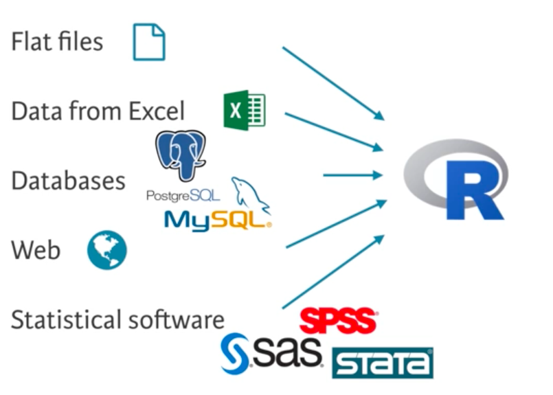

# Data Handling in R

R has been designed as a language for data analysis. It provides a number of built-in data structures and functions to make common data handling tasks easier. Here we will look at *factors*, *lists* and *data frames*.


## Factors

The term *factor* refers to a data type used to store *categorical variables*. The difference between a categorical variable
and a continuous variable is that a categorical variable can belong to a limited number of categories. A continuous variable, on the
other hand, can correspond to an infinite number of values.

It is important that R knows whether it is dealing with a continuous or a categorical variable, as statistical models treat both types differently.

An example of a categorical variable is the class of a vertebrate:
```{r}
vert.class <- factor( c("Bird", "Amphibian", "Bird", "Mammal", "Fish", "Mammal") )

```

Factors have an attribute called *levels*, which represent the unique categories.
```{r}
levels(vert.class)
```

The simplest thing we can do with a factor is compute a frequency table:
```{r}
table(vert.class)
```

Comparisons and coercion can be deployed on factors:
```{r}
vert.class == "Bird"
as.numeric(vert.class)
```


### Ordered Factors {-}

There are two types of categorical variables: *nominal* and *ordinal*.

A nominal variable is a categorical variable without an implied order. This means that it is impossible to say that one value is greater than another.
For example,

```
animals <- factor( c("Elephant", "Giraffe", "Donkey", "Horse") )
```

Here, it is impossible to say that one value is inherently greater than or less than another.

In contrast, ordinal variables do have a natural ordering.
Consider for example the categorical variable temperature vector with the
categories: “Low“, “Medium“ and “High“.

```
temperature <- c("High","Medium","Low")
```

Here it is clear that `"High"` > `"Medium"` > `"Low"`.


To deal with the natural ordering between different categories of a factor, we need to create an ordered factor:
```{r}
speed <- c("medium", "slow", "slow", "medium","fast")
speed <- factor(speed, ordered = TRUE, levels = c("slow", "medium", "fast"))
speed
```

The ordered factor enables us to compare different elements:
```{r}
speed[2] > speed[5]
```


## Lists

A *list* in R allows you to gather a variety of objects under one name in an ordered way.

These objects do not have to be of the same class or of the same length:
```{r}
# Vector with numerics from 1 up to 10
my.vec <- 1:10
# Matrix with numerics from 1 up to 9
my.mat <- matrix(1:9, ncol = 3)
# A numeric value (scalar)
my.sca <- 53

# Construct list with these different elements:
my.list <- list(vec = my.vec, mat = my.mat, sca = my.sca)
my.list
```

The names() function can be used to show the names of the list elements, or to rename them.
```{r}
names(my.list)

names(my.list) <- c("a", "b", "c")
my.list
```


There are several ways to refer to an element of a list. The following three expressions are equivalent:
```{r}
my.list$c
my.list[["c"]]
my.list[[3]]
```


## Data frames

A data frame is a special kind of list, and is the most commonly used data type for statistical analysis in R.
A data frame uses the variables of a dataset as columns and the observations as rows.

Here, different variables may have different classes (e.g. character, numeric, logical), and the data frame will preserve this.

For example, when doing a market research survey, we often have questions such as:

- 'Are you married?' or 'yes/no' questions (logical)
- 'How old are you?' (numeric)
- 'What is your opinion on this product?' or other ’open-ended’ questions (character)

To construct a data frame in R, we use the `data.frame()` function. As arguments, we pass pre-defined vectors that become
the different columns of the data frame. The argument vectors should all have the same length.

```{r}
# Definition of vectors
vec.name <- c("Mercury", "Venus", "Earth", "Mars", "Jupiter", "Saturn", "Uranus", "Neptune")
vec.type <- c("Terrestrial", "Terrestrial", "Terrestrial", "Terrestrial", "Gas giant", "Gas giant", "Ice giant", "Ice giant")
vec.mass <- c(0.0553, 0.815, 1, 0.107, 317.8, 95.2, 14.5, 17.1)
vec.diameter <- c(0.383, 0.949, 1, 0.532, 11.21, 9.45, 4.01, 3.88)
vec.day.length <- c(175.9, 116.8, 1, 1.03, 0.414, 0.444, 0.718, 0.671)
vec.distance.from.sun <- c(0.387, 0.723, 1, 1.52, 5.20, 9.58, 19.2, 30.05)
vec.orbital.period <- c(0.241, 0.615, 1, 1.88, 11.9, 29.4, 83.7, 163.7)
vec.rings <- c(FALSE, FALSE, FALSE, FALSE, TRUE, TRUE, TRUE, TRUE)

# Create a data frame from the vectors
planets <- data.frame(name=vec.name, type=vec.type, mass=vec.mass, diameter=vec.diameter, day.length=vec.day.length, distance.from.sun=vec.distance.from.sun, orbital.period=vec.orbital.period, rings=vec.rings, stringsAsFactors=FALSE)

# Convert type to a factor
planets$type <- factor( planets$type )

planets
```


Note that we can control whether character data is automatically converted to factors by setting the argument `stringsAsFactors` to `TRUE` or `FALSE`.

When working with large data sets, a data analyst's first task is to develop a clear understanding of its structure and main elements.
Therefore, it is often useful to show only a small part of the entire data set.

`head()` and `tail()` print out the first and last observations of a data frame.

```{r}
head(planets, n=3)
```

```{r}
tail(planets, n=3)
```


To get a rapid overview of the data, the function `str()` is used, which shows the structure of the dataset in hand.
For a data frame it tells us:

- The total number of observations
- The total number of variables
- A full list of the variables names
- The data type of each variable
- The first few observations for each variable

```{r}
str(planets)
```


To select data from the data frame, we can either treat it as a matrix:

```{r}
# this returns a scalar
planets[2,4] # a single element indexed by row and column
```

```{r}
# this returns a vector
planets[1:3,"mass"] # a single column for a subset of rows
```

```{r}
# these both return a data frame
planets[1:3,] # a subset of rows
planets[planets$rings,] # selects the planets with rings
```

or we can treat the data frame as a list of vectors:

```{r}
planets[[3]]
planets$rings
```


Another way to select create a subset of a data frame based on some condition is to use the `subset()` function.

```{r}
subset(planets, type=="Ice giant")
```

To sort the data according to a certain variable in the data set, the function `order()` is used.

```{r}
order(planets$diameter)
planets <- planets[order(planets$diameter),]
planets
```


#### Exercise 4a {-}

Add a new column to `planets` to show the density of each planet relative to Earth (correct to 3 d.p.).

```{r}

```


## Importing data

R allows for importing files of the following types:



*Flat files* are simple text file formats that structure data as tables.

The most straightforward way to read tabular data into a data frame is to import from a `.csv` (comma separated value) file.
The advantage of this is that `.csv` is a standard format.

The file `states.csv` contains a *header row*, giving the names of the fields:
```
state,capital,pop_mill,area_sqm
South Dakota,Pierre,0.853,77116
New York,Albany,19.746,54555
Oregon,Salem,3.970,98381
Vermont,Montpelier,0.627,9616
Hawaii,Honolulu,1.420,10931
```

We can load it using the `read.csv` function:
```{r}
my.df <- read.csv("states.csv", stringsAsFactors = FALSE)
my.df
```


Similarly, the most convenient format to output data frames is csv.
```{r}
write.csv(my.df,"my.csv")
```


Here are a few useful functions for understanding the structure of your data:
- `class()` - Class of data object
- `dim()` - Dimensions of data
- `names()` - Column names
- `str()` - Preview of data with helpful details
- `summary()` - Summary of data


#### Exercise 4b {-}

Load the `mlb_players.csv` data into your workspace. This contains biometric data for Major League Baseball players.

Try the following to get a feel for the data:

1. How many records and how many fields?
2. What are the column names?
3. View the structure of the data frame.
4. View a `summary()` of the data frame.

```{r}

```


#### Exercise 4c {-}

1. Write a function `bmi` that takes a person's weight in lbs and height in inches and returns their [Body Mass Index](https://www.nhs.uk/common-health-questions/lifestyle/what-is-the-body-mass-index-bmi/).
```{r}

```

2. Using your function, add a new column `BMI` to the data frame.
```{r}

```

3. According to BMI, what percentage of players would be considered overweight or obese?
```{r}

```


